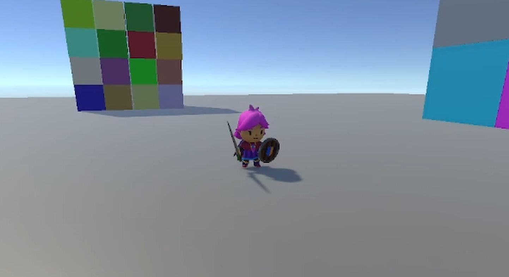

# Third-Person Physics-Based Character Controller

A responsive, physics-driven third-person character controller designed for immersive and natural movement in Unity. This system integrates rigidbody physics to provide realistic interactions while maintaining precise player control. 
## Demo of current state (Click to watch!)
[](https://drive.google.com/file/d/1ZupTQec9_AhBBzHgQ18--6Ea0VsHZwAM/view?usp=drive_link)

## Features
- **Physics-Based Movement**: Uses forces and torques for natural locomotion.
- **Jumping & Air Control**: Smooth transition between ground and air movement.
- **Customizable Character Parameters**: Speed, jump height, and responsiveness can be easily adjusted.
- **Camera System Integration**: Works with third-person cameras for smooth tracking.
- **Modular Input System**: Supports different control schemes via Unity's new input system (keyboard, gamepad, etc.).

## Installation
1. Clone the repository:
   ```sh
   git clone https://github.com/tommiedizon/Third-Person-Physics-Based-Character-Controller.git
   ```
2. Open the project in Unity (Unity 2023.x or later recommended).
3. Import the required Assets (Cinemachine)
4. Adjust movement settings in the Unity Inspector.

## How It Works
- **Rigidbody Physics**: Movement applies forces instead of directly modifying position to allow it to interact with Unity's Physics Systems
- **Ground Detection**: A ground detection class was implemented using sphere casting.
- **State Machine**: Uses the state machine pattern to manage various movement states and animations seamlessly
- **Input System**: Uses the features of Unity's new input system for efficient player input handling
- **Camera System**: Cinemachine is used to implement smooth and responsive camera movement.

## Planned Features
- **Slope Handling**: Handle slopes realistically
- **Stair Handling**: Handle stairs realistically (maybe include some procedural animation like in Zelda)
- **Multiplayer Compatibility**: Sync movement for networked players.
- **Camera Collisions**: Detect collisions and adjust the camera to avoid obstacles.

## Contact
For questions or feedback, reach out via GitHub Issues or @ thomasjdizon@gmail.com

